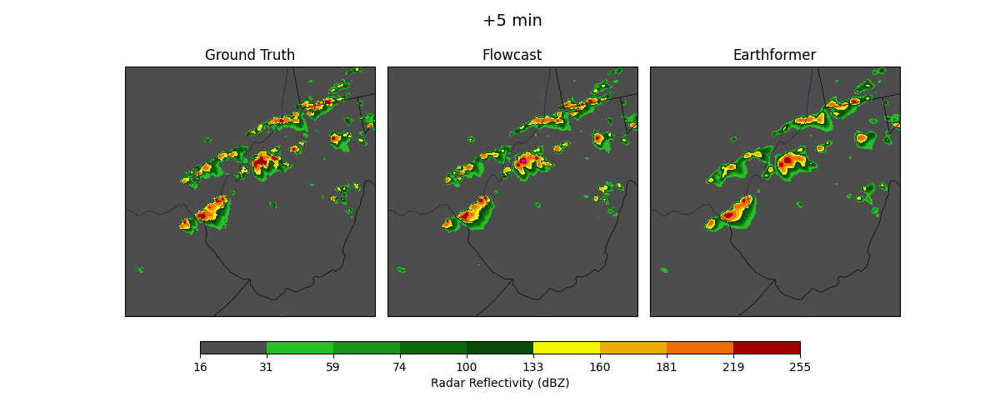

# FlowCast: Advancing Precipitation Nowcasting with Conditional Flow Matching

**Authors:** Bernardo Perrone Ribeiro, Jana Faganeli Pucer (University of Ljubljana)

This repo contains the official implementation of the paper ["FlowCast: Advancing Precipitation Nowcasting with Conditional Flow Matching"](https://openreview.net/pdf?id=47ToW7T1iU) accepted to **ICLR 2026**.

## Introduction

Radar-based precipitation nowcasting, the forecasting of short-term precipitation fields from radar imagery, is a critical challenge for flood risk management. While diffusion models have recently shown promise in generating sharp, reliable forecasts, their iterative sampling process is often computationally prohibitive for time-critical applications.

We introduce **FlowCast**, the first end-to-end probabilistic model leveraging **Conditional Flow Matching (CFM)** as a direct noise-to-data generative framework for precipitation nowcasting. Unlike hybrid approaches or standard diffusion models, FlowCast learns a direct noise-to-data mapping in a compressed latent space.



## Installation

This codebase is designed to be reproducible using Conda.

**1. Create the environment:**

```bash
conda create -n nowcasting python=3.10.16
conda activate nowcasting
pip install torch torchvision --index-url https://download.pytorch.org/whl/cu126
pip install -r requirements.txt
```

## Datasets

### SEVIR

We utilize the [SEVIR dataset](https://sevir.mit.edu/). To prepare the data:


1. **Install AWS CLI:**
```bash
Follow the instructions in https://docs.aws.amazon.com/cli/latest/userguide/getting-started-install.html
```

2. **Download VIL data:**
```bash
mkdir -p datasets/sevir/data/sevir_complete/data/vil
aws s3 cp --no-sign-request s3://sevir/CATALOG.csv datasets/sevir/data/sevir_complete/CATALOG.csv
aws s3 sync --no-sign-request s3://sevir/data/vil datasets/sevir/data/sevir_complete/data/vil
```

3. **Preprocess:**
```bash
python datasets/sevir/sevir_preprocessing.py \
  --catalog_csv_path datasets/sevir/data/sevir_complete/CATALOG.csv \
  --data_dir datasets/sevir/data/sevir_complete/data \
  --val_cutoff "2019-01-01 00:00:00" \
  --test_cutoff "2019-06-01 00:00:00" \
  --output_dir datasets/sevir/data/sevir_full \
  --img_type vil \
  --keep_dtype True \
  --downsample_factor 1
```

### ARSO

The ARSO dataset mentioned in the paper is currently not publicly available.

## Training and Testing

The training pipeline consists of two main stages: training the Autoencoder to compress the data, and then training the FlowCast CFM model in the latent space.

### 1. Train Autoencoder

Train the KL-regularized Autoencoder to compress high-dimensional radar data.

```bash
torchrun --nnodes=1 --nproc_per_node=4 \
experiments/sevir/autoencoder/dist_train_autoencoder_kl.py \
--config experiments/sevir/autoencoder/autoencoder_kl_config.yaml \
--train_file datasets/sevir/data/sevir_full/nowcast_training_full.h5 \
--train_meta datasets/sevir/data/sevir_full/nowcast_training_full_META.csv \
--val_file datasets/sevir/data/sevir_full/nowcast_validation_full.h5 \
--val_meta datasets/sevir/data/sevir_full/nowcast_validation_full_META.csv
```

### 2. Generate Latent Dataset

Once the autoencoder is trained, generate the static latent dataset to speed up FlowCast training.

*Note: Replace `path/to/auto_encoder_model.pt` with your actual checkpoint.*

```bash
python experiments/sevir/autoencoder/generate_static_dataset.py \
    --config experiments/sevir/autoencoder/autoencoder_kl_config.yaml \
    --preload_model path/to/auto_encoder_model.pt \
    --train_file datasets/sevir/data/sevir_full/nowcast_training_full.h5 \
    --train_meta datasets/sevir/data/sevir_full/nowcast_training_full_META.csv \
    --val_file datasets/sevir/data/sevir_full/nowcast_validation_full.h5 \
    --val_meta datasets/sevir/data/sevir_full/nowcast_validation_full_META.csv \
    --out_dir datasets/sevir/data/sevir_latent_vae
```

### 3. Train FlowCast (CFM)

Train the Conditional Flow Matching model on the latent data.

```bash
torchrun --nnodes=1 --nproc_per_node=4 \
experiments/sevir/runner/flowcast/dist_train_flowcast.py \
--config experiments/sevir/runner/flowcast/flowcast_config.yaml \
--train_file datasets/sevir/data/sevir_latent_vae/nowcast_training_full.h5 \
--train_meta datasets/sevir/data/sevir_latent_vae/nowcast_training_full_META.csv \
--val_file datasets/sevir/data/sevir_latent_vae/nowcast_validation_full.h5 \
--val_meta datasets/sevir/data/sevir_latent_vae/nowcast_validation_full_META.csv \
--partial_evaluation_file datasets/sevir/data/sevir_full/nowcast_validation_full.h5 \
--partial_evaluation_meta datasets/sevir/data/sevir_full/nowcast_validation_full_META.csv
```

### 4. Testing

Evaluate the trained model. Point `--artifacts_folder` to the output directory of the previous step.

```bash
python experiments/sevir/runner/flowcast/test_flowcast.py \
    --artifacts_folder saved_models/sevir/flowcast \
    --config experiments/sevir/runner/flowcast/flowcast_config.yaml \
    --test_file datasets/sevir/data/sevir_full/nowcast_testing_full.h5 \
    --test_meta datasets/sevir/data/sevir_full/nowcast_testing_full_META.csv
```

### Resource Estimates

Training times are estimated based on a single node with 4 x H100 GPUs. Inference times are estimated for a single node with 2 x H100 GPUs.

| Model Component | Script | Step | Approx. Time
| --- | --- | --- | --- |
| Autoencoder | `dist_train_autoencoder_kl.py` | Training | ~24 hours |
| FlowCast (CFM) | `dist_train_flowcast.py` | Training | ~150 hours |
| FlowCast (CFM) | `test_flowcast.py` | Inference | ~36 hours |

## Citation

```bibtex
@inproceedings{
    ribeiro2026flowcast,
    title={FlowCast: Advancing Precipitation Nowcasting with Conditional Flow Matching},
    author={Bernardo Perrone Ribeiro and Jana Faganeli Pucer},
    booktitle={The Fourteenth International Conference on Learning Representations},
    year={2026},
    url={https://openreview.net/forum?id=47ToW7T1iU}
}
```
